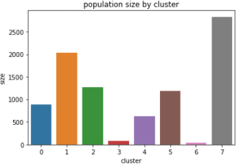
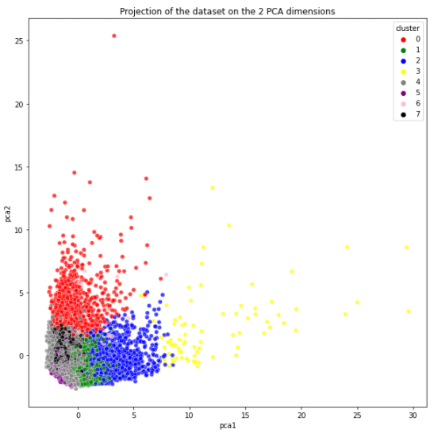

# Customer-Marketing-segmentation-with-Machine-Learning
Use unsupervised machine learning tools to segment credit card customers

In this project, the objective is to segment a portfolio of credit card users according to usage characteristics. Customer segmentation is then used by marketing department to tailor products and services specific to these customer segments. This project is part of UDEMY Datascience for Business program by Dr. Ryan Ahmed using Google Colab.

# Dataset
The project uses a dataset of circa 9000 credit card users and their credit card usage pratice.

# Objective
The objective is to :
1) analyze the dataset and 
2) define customer segments based on consumption behaviors using machine learning and dimensionality reduction.

Several unsupervised tools are implemented:
- K-Means. Optimal number of segments are determined using Elbow method.
- PCA (Principal Composant Analysis). Apply dimensionality reduction.
- Autoencoder (simple encoder-decoder fully connected network in Keras)

# Project structure
- Data exploration.
  - Data wrangling and cleaning
  - Data analysis and visualization for salient elements, trends and correlations
- K-means application
- Principal Componant Analysis
- Perform dimensionality reduction using Autoencoders

# Results

Identified customer segments:
- first customers cluster (revolvers) who use credit card as a loan (most lucrative sector): highest balance ($5000) and cash advance (~$5000), low purchase frequency, high cash advance frequency (0.5), high cash advance transactions (16) and low percentage of full payment (3%)
- second customers cluster (Credit purchasers) with high purchase frequency (0.9) who use payment installment facility the most (highest installment frequency 0.83), pay in full whenever possible (second highest Percentage of full payment = 25%) and do not use costly cash advance service
- Third customers cluster (Active cash buyers): Those are active buyers paying in full. Cluster with highest purchase frequency (0.93), second highest purchase transactions and one-off purchases, highest % of payment in full (29%)
- Fourth customer cluster (VIP/Prime): high credit limit $12K and highest percentage of full payment, target for increase credit limit and increase spending habits
- Fith customer cluster (low tenure): these are customers with low tenure (7 years), low balance
- Sixth Customers cluster (Transactors): Those are customers who pay least amount of interest charges and careful with their money, Cluster with lowest balance ($104) and second lowest cash advance ($303), Percentage of full payment = 24%
- Seventh customer cluster (one-off): Record-high minimum payments level of nearly 28k$
- Eighth customer cluster (Low activity): these are customers using the less their card (lowest purchase frequency) and with the lowest purchase amount

Key segment characteristics:

Looking at the population per segment, clusters "VIP/Prime" and "one-off" are very small and represent some kind of exceptions / outliers. They unlikely constitute potential market segments within the observed population.

Population per segment:

The last picture shows the dataset projection on two principal component axis after dimensionality reduction towards 2D feature space (from 17 features to 2 features). These two dimensions retain 48% of the total variance of the dataset. The axes represents the direction of maximum variance in the data (eigen vectors).

